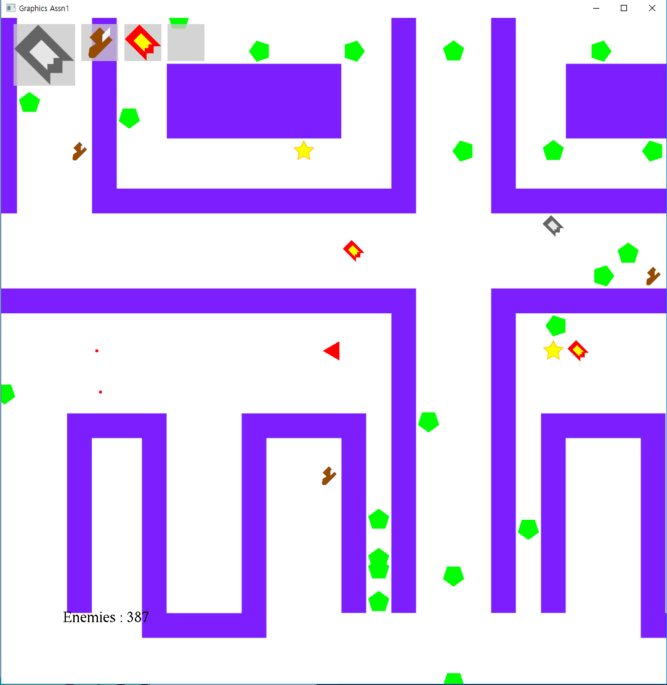

# Graphics Assn #1

##### <span style="float:right">20160785 양준하, 20160463 성해빈 </span>

## Introduction
이번 과제는 Opengl, 더 구체적으로는 glew와 freeglut를 이용해서 2D게임을 만드는 것을 목표로한다. 과제의 구현을 위해 OpenGL의 기본적인 이해, 카메라 구현을 위한 2D변환, 프레임관리, 키보드입력, 폴리곤과 텍스트의 출력 등 다양한 측면에 대한 실습을 할 수 있었다.

## Background
### OpenGL, glew, freeglut
<p style="text-align:justify">Opengl은 대표적인 크로스 플랫폼 라이브러리이다. opengl은 각 플랫폼이나 언어, 드라이버마다 구현이 다 다르므로 이것을 쉽게 사용할 수 있게 해주기 위해, 또 추가적인 기능을 더 쓸 수 있게 하기 위해 glew라는 extension loading library를 사용한다. freeglut는 순수 그래픽인 opengl에서 키보드 입력, 타이머,  마우스 입력 등등의 유틸리티 기능을 추가한 toolkit이다.</p>

### 2D Rendering
우리가 작성하는 opengl 프로그램은 각 프레임마다 새로 화면을 계속 그려내는 식이다. double buffer로 애니메이션을 부드럽게 구현할 수 있으며, glViewport로 화면을 얼마만큼 렌더링할 것인지를 정하고, gluOrtho2D로 virtual world의 얼마만큼을 clipping할 것인지를 정한다. 이 clipping할 구역을 바꾸면서 세계 렌더링을 똑같이 하면 카메라 움직임이 되는 것이다. UI는 사이즈와 위치가 고정되는 것을 원하는데, 그 때는 사용자의 화면 비율과 같은 좌표계를 선언해서 고정 사이즈의 UI를 구현했다.

### default reshapefunc

https://www.opengl.org/resources/libraries/glut/spec3/node48.html 에서 보면

```
If a reshape callback is not registered for a window or NULL is passed to glutReshapeFunc (to deregister a previously registered callback), the default reshape callback is used. This default callback will simply call glViewport(0,0,width,height) on the normal plane (and on the overlay if one exists).
```

reshape func를 지정하지 않았는데도 reshaping이 되는 것을 볼 수 있다. 그 이유는 default reshape callback이 있기 때문이다. `glViewport(0,0,width,height)`

### reshapefunc, displayfunc

reshape이 실행되고 나서, display가 실행된다.

첫 시작때도 reshape이 한 번 실행되고 display가 한 번 실행된다.

display는 이외에도 키보드 인풋이나 클릭에 반응해서 실행되기도 한다.

결국 여기서의 포인트는 display가 기본값으로는 지속적으로 실행되지는 않는다는 점이다.

### glclear, glclearcolor

glclearcolor는 glclear에 쓰일 초기화값을 설정해준다.

glclearcolor() -> glclear() 의 순서로 써야 한다는 뜻이다.

한 번 세팅해놓은 glclearcolor()는 glclear() 여러 번에 계속 적용된다.

### glutPostRedisplay()

glutDisplayFunc에 등록된 함수를 호출시켜준다. 다시 말해서 창을 다시 그려준다. 애니메이션을 구현하려면 지속적으로 display를 불러야하므로 필수다. 

### glLoadIdentity

새로 display를 그릴 때 반드시 필요한 작업으로, 현재 MatrixMode에 따른 matrix를 identity matrix로 초기화해주는 작업이다. 

### glMatrixMode

MatrixMode에는 4가지가 있는데, 우리는 원시적인 2D 구현이므로 다른 matrix로의 전환을 쓸 일이 아직 없다.

GL_MODELVIEW: 기본값

GL_PROJECTION

GL_TEXTURE

GL_COLOR

### glGet

opengl은 state machine을 표방하고 있어, 각각의 설정들이 ON/OFF 로 되어 있는지의 확인이 필요하다.

`glGet`으로 현재 MatrixMode나, 컬러나, 그런 잡다한 모든 설정 변수들을 확인할 수 있다.

### glutKeyboard

ASCII code에 있는 건 key, 그 외는 specialkey이다.

special key ref : https://www.opengl.org/resources/libraries/glut/spec3/node54.html

추가 인자로 받는 x와 y는 그 키를 눌렀을 때의 mouse location이다.

glut에서 지원하는 함수는 glutKeyboardFunc, glutSpecialFunc, glutKeyboardUpFunc, glutSpecialUpFunc 등이 있다. 

KeyboardFunc는 keyboard down일때 불리는데, 꾹 누르고 있으면 지속적으로 불리지 않고 특정한 주기로 띄엄띄엄 불린다. KeyboardUpFunc는 keyboard를 떼면 불리는 함수이다. 사용자가 키보드를 꾹 누를 때를 감지하기 위해서는 keyboard down 함수에서 어떤 저장상태를 만들어내고, 엔진쪽에서 저장상태를 체크하는 과정이 필요하다.

### glShadeModel

`GL_FLAT`과 `GL_SMOOTH`존재, flat shading과 smooth shading을 관리한다. 2D는 별 차이가 없는듯하다. 

## Gameplay
게임은 맵의 왼쪽 아래 모서리에서 시작한다. 
### Player

플레이어는 빨간색 세모로 표시된다. 방향키를 이용해 플레이어가 가는 방향을 조작할 수 있으며, 스페이스를 누르면 플레이어가 바라보는 방향으로 총알을 1개 쏘고, 그 옆에 미사일도 2개를 쏜다. 총알과 미사일은 벽을 만나면 소멸한다.


### Enemy

적은 초록색 오각형으로 표시된다. 적은 평소에 랜덤하게 상하좌우로 움직이다가,  일정거리 내에 플레이어가 감지되면 dijkstra 알고리즘을 이용해 플레이어를 추적한다. 적들의 감지거리와 이동속도는 맵에 남아있는 적들의 수에 반비례하므로 게임이 진행될수록 더욱 난폭해진다. 적은 랜덤으로 생성되지만, 적의 개수는 맵 파일에서 받아온다.  원활한 게임 진행을 위해 플레이어가 스폰되는 주변 구역에는 적을 배치하지 않는다. 왼쪽 아래에 남은 적들의 수가 표시되고, 적들이 다 죽으면 게임이 클리어된다.


### Item

아이템은 게임 시작때마다 랜덤으로 생성되고, 아이템의 개수는 맵 파일에서 받아온다. 플레이어가 아이템에게 다가가면 아이템을 먹게 되며, 먹은 아이템은 queue의 형태로 가장 먼저 먹은 아이템부터 사용할 수 있으며, 'q'키로 사용할 수 있다. 왼쪽 위에 사용할 수 있는 아이템이 순서대로 4개까지 표시된다.


#### 메가파이어

전방향으로 총알을 다량 쏜다.


#### 슈퍼파이어

상하좌우 방향으로 총알을 다량 쏜다.


#### 카메라

잠시동안 시야를 넓혀준다.


#### 신발

잠시동안 이동속도가 빨라진다.


#### 별

잠시동안 무적이 된다. 


## Implementation
### Develop Environment

<<<<<<< HEAD
개발환경은 Visual Studio 2017 C++, 주어진 freeglut와 glew, glm 0.9.9.2 , winsdk 10.0.17134 이다. 
**빌드는 Release로 해야하는데, STL의 사용이 많아 debug로 빌드하면 각종 Assertion들이 난무해서 게임속도가 심각하게 느려져서 정상적인 플레이가 불가능 할 수도 있다.**
=======
개발환경은 Visual Studio 2017 C++, 주어진 freeglut와 glew, glm 0.9.9.2 , winsdk 10.0.17134, opengl 4.6 이다. 
>>>>>>> master

### OpenGL

Graphic Rendering에 관련된 코드는 모두 CGraphics.cpp와 CGraphics.h에 있다. 텍스트를 제외한 모든 게임요소는 Polygon의 조합으로만 표현되어있다. 

##### M_RenderGame

map과 게임 오브젝트(총알, 플레이어, 적, 아이템) 등을 렌더링한다.

##### M_RenderUI

아이템 창과 남은 적들의 수, 게임 클리어와 게임 오버 화면 등을 보여준다. RenderGame과는 다른, 화면과 같은 비율의 좌표를 사용해서 게임화면의 카메라가 움직여도 같은 사이즈와 같은 위치를 유지한다.

##### M_MoveCamera

카메라를 플레이어 쪽으로 이동시켜 게임이 스크롤 될 수 있도록 한다. 이 때 그냥 움직이지 않고 섬세한 가속도 처리로 자연스러운 카메라 워크를 구현했다.

##### M_Draw~~

선, 별, 다각형, 폰트, 아이템 등을 렌더링한다.

원의 경우 다각형의 각을 높게 설정해주면 된다.

폰트는 2가지 함수가 있는데, 하나는 비트맵 폰트(glutBitmapCharacter), 입체 폰트(glutStrokeString) 2개다. glutBitmapCharacter는 최대 사이즈가 너무 작아서 큰 폰트를 작성할 때에는 입체 폰트를 사용한다.

아이템 드로잉은 GL_POLYGON으로 한다. 

##### M_CallbackDisplay

프로그램의 display callback에서 불리는 함수다. Game과 UI의 개별적인 좌표계를 gluOrtho2D로 설정하고, RenderGame과 RenderUI를 불러주는 역할을 한다. 마지막에는 glutSwapBuffers()로 이중 버퍼를 구현한다.

##### M_CallbackReshape

프로그램의 reshape callback에서 불리는 함수다. Viewport를 설정하고, Screen size를 저장해주는 역할을 한다.

##### M_CallbackIdle

프로그램의 idle callback에서 불리는 함수다. glutPostRedisplay()를 부르는 것 말고는 역할이 없다.

### Game Logic

게임로직은 CEngine에서 전부 처리 된다.  

CSomething은 형상, 위치, 크기 등을 가지는 기본적인 게임의 오브젝트를 나타내는 클래스다. CBullet, CCharacter, CEnemy, CItem 모두가 CSomething을  상속한다.

Helper 디렉터리에 있는 각종 클래스들은 게임로직의 연산을 위한 보조클래스들으로, 수학적 벡터, 그리드, 각종 수학연산, 메세지큐 등 다양한 유틸리티를 제공한다. (모두 직접 만든 것이다.) 그 중 일부는 싱글톤 패턴으로 만들어졌으니 염두하여야 한다

#### CEngine
게임로직의 핵심은 CEngine에서 일어난다. 오브젝트들은
```c++
shared_ptr<CCharacter> V_Player;
set <shared_ptr<CSomething>> V_Objects; //Bullet, Enemy, Item
```
로 관리되고 그 외에 맵에 관련된 정보나 게임 파라미터들을 멤버변수로 가지고 있다.
메서드(private, public 모두)를 간단하게 설명한다.

##### M_Loop
매 프레임마다 업데이트될 게임의 모든 변동사항을 총괄하는 public 메소드로, main에서 적절히 시간을 재서 호출한다.

##### M_ObjectIndexing

CSomething으로 Polymorphic한 상태에 있는 V_Objects들을 오브젝트 종류별로 인덱싱한다.

##### M_CollisionTest
충돌 판정이 필요한 오브젝트들 (캐릭터-아이템, 캐릭터-적, 총알-적 등)간 충돌을 검사하고 적절한 행동을 취한다. 만약 여기서 오브젝트가 사라져야한다면 STL set인 V_Objects에서 remove해버린다.

##### M_ListenMessages

다른 클래스(CSomething 혹은 키보드관련)에서 온 메세지를 처리한다.

##### M_EnemyNavigation

적들의 추적능력을 관리한다. 일단 일정거리안에 있는지 확인한 후 너무 멀면 랜덤하게 움직이게, 가까우면 Dijkstra 알고리즘을 이용해 주인공을 추적하게 액션큐에 움직임을 추가한다. 일반적인 Dijkstra와 달리 주인공을 찾으면 바로 알고리즘을 종료하게 하는 최적화와 움직임의 랜덤성을 위해 visit하는 방향의 offset을 랜덤하게 하는 테크닉이 사용되었다.

##### M_CheckKeyPress
꾹 누르는 것에 해당하는 액션을 오브젝트에게 전달해준다. CUserInput이라는 싱글톤 클래스가 인풋과 관련된 정보를 관리하고, glut에 등록된 콜백함수들을 이용한다

##### M_Event_KeyPress & M_ItemUse
press down에 해당하는 액션을 처리한다. M_ListenMessages에서 호출된다.

## Example




## Discussion

### Frame

Idle때 호출되는 함수에서 정확하게 해줘야되는 처리에 대해 더 연구할 필요가 있다. 현재는 시간을 재서 실제 모니터 주사율인 60fps 정도로 redisplay와 engine의 업데이트를 호출을 하는 식으로 해결했으나 어떨때 idle자체가 모니저 주사율에 dependent해지는 이상 행동을 보일때가 있어서 좀더 탐구가 필요하다.

### Animation
각 오브젝트들이 어떤 모양으로 출력될지 프레임마다 변화를 주어 달릴 때에 꿈틀거린다든지 하는 효과를 줄 수 있을 것 같다. 현재는 모든 오브젝트를 폴리곤으로 출력하고 있지만 텍스쳐로 출력할 수 있다면 더욱 애니메이션을 잘 활용할 수 있을 것으로 생각한다.

## Conclusion
결론적으로 이번 어싸인에서는 OpenGL의 2D드로잉 기술을 사용하면서 기본적인 기능 및 2D 렌더링의 파이프라인에 대해서 알아볼 수 있었다. 


## Reference

OpenGL 사용법에 대해서는 레퍼런스를 참고했으나 게임로직은 100% 원본이다.

[The OpenGL Utility Toolkit (GLUT) Programming Interface API Version 3](https://www.opengl.org/resources/libraries/glut/spec3/spec3.html)

[OpenGL® 4.5 Reference Pages](https://www.khronos.org/registry/OpenGL-Refpages/gl4/)

[Lighthouse3d.com](http://www.lighthouse3d.com/tutorials/glut-tutorial/)

[opengl-tutorial](http://www.opengl-tutorial.org/)


