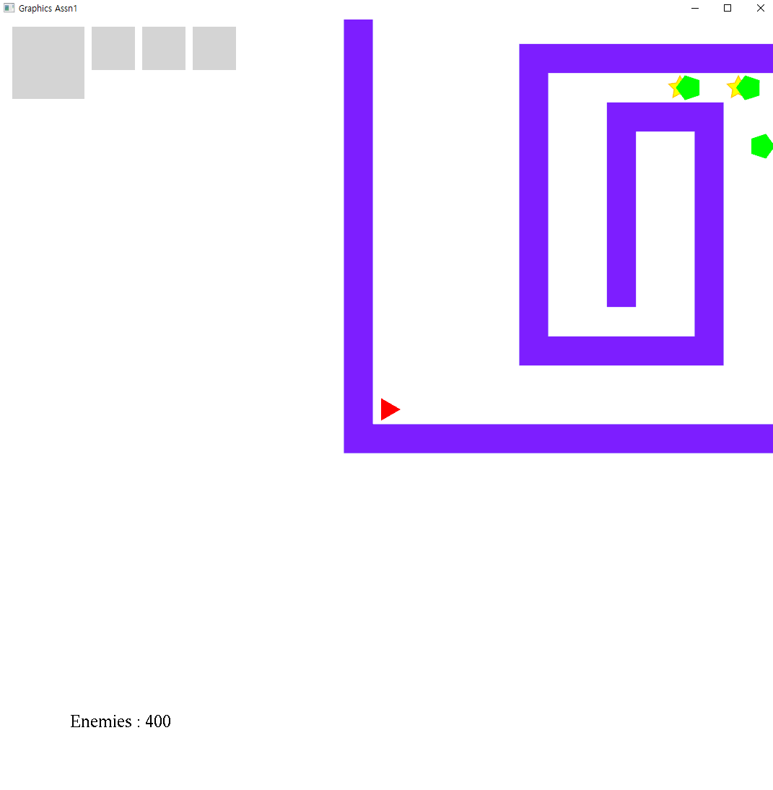
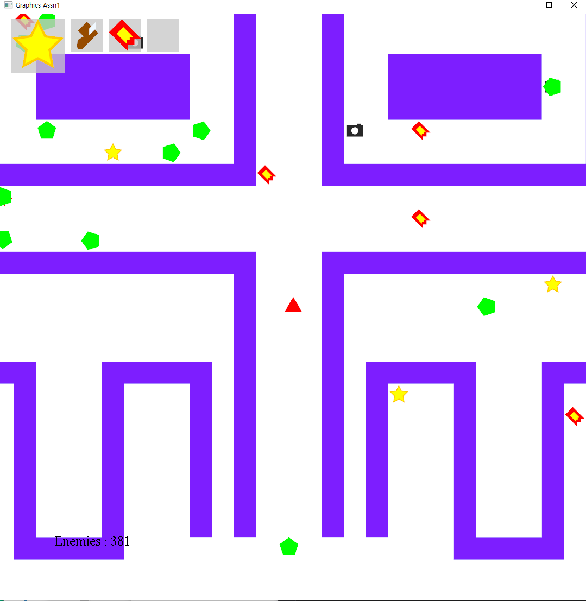
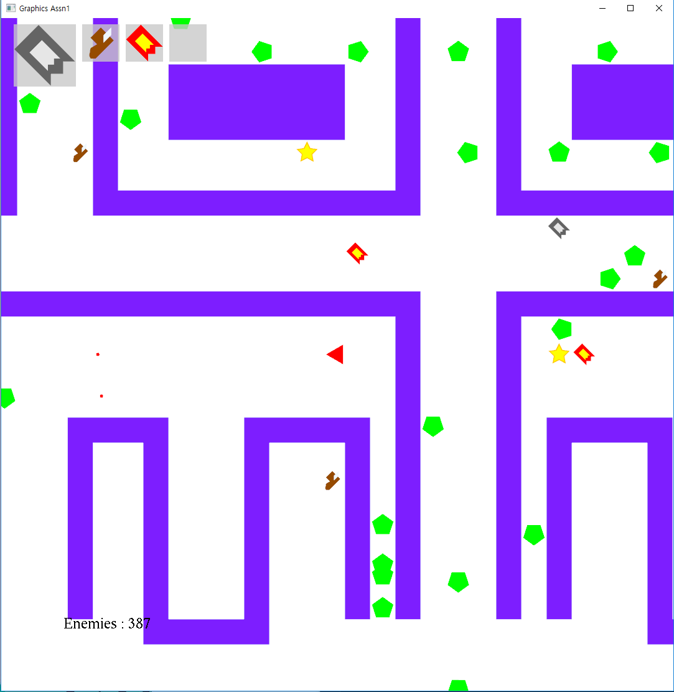

# Graphics Assn #2

##### <span style="float:right">20160785 양준하, 20160463 성해빈 </span>

## Introduction
이번 과제는 지난 Assn1을 바탕으로 하여 opengl의 셰이더를 사용하고 Hierarchy 모델을 만드는 것이 목적이다.

## Background
### Transform
<p style="text-align:justify">Opengl은 대표적인 크로스 플랫폼 라이브러리이다. opengl은 각 플랫폼이나 언어, 드라이버마다 구현이 다 다르므로 이것을 쉽게 사용할 수 있게 해주기 위해, 또 추가적인 기능을 더 쓸 수 있게 하기 위해 glew라는 extension loading library를 사용한다. freeglut는 순수 그래픽인 opengl에서 키보드 입력, 타이머,  마우스 입력 등등의 유틸리티 기능을 추가한 toolkit이다.</p>

### 2D Rendering
## Gameplay
게임플레이 자체는 Assn1과 완벽하게 동일하지만 몇가지 그래픽적인 차이가 생겼다.
### Player

### Enemy

### Item

## Implementation

전반적인 구조는 Assn1과 동일하다. 매트릭스 연산은 모두 glm으로 수행하였다.

### Develop Environment

개발환경은 Visual Studio 2017 C++, 주어진 freeglut와 glew, glm 0.9.9.2 , winsdk 10.0.17134, opengl 4.6 이다. 

빌드는 Release로 해야하는데, STL의 사용이 많아 debug로 빌드하면 각종 Assertion들이 난무해서 게임속도가 심각하게 느려져서 정상적인 플레이가 불가능 할 수도 있다.

### Text

### CShaderManager

CShaderManager는 셰이더와 폴리곤을 관리하는 Singltone클래스로, 처음에 한번 초기화 되며 그 이후에 CGraphics에서 종종 참조된다.

##### CShaderManager::CShaderManager()

밑에서 설명할 하위 함수들을 호출하여 셰이더와 버텍스를 로딩하는 전체 초기화를 수행하는 생성자다. 이 초기화 과정에서 외부에 있는 파일을 읽어와서 파싱하는 작업을 대거 하게 되는데, 이 포맷 자체는 간단하게 만든 독자포맷이다.

##### CShaderManager::M_LoadShader()

셰이더를 로드해서 컴파일 한다. 이 부분은 아래 명시된 레퍼런스를 참조하였다. 
```c++
GLuint id = glCreateShader(type);
//중략
glShaderSource(id, 1, &sp, NULL);
glCompileShader(id);
```
핵심적으로 사용된 opengl 로직은 위와 같다.
##### CShaderManager::M_LoadPolygon()

폴리곤을 로드한다. 프로그램에서 사용될 다양한 오브젝트들은 다 여기서 로드되는 폴리곤을 transform해서 만들어지는 것이다. 파싱이 수반된다.

##### CShaderManager::M_LoadProgram()

opengl의 셰이더가 attach되는 오브젝트이 program을 생성하고 관리한다. 당장 필요한 기능은 아니지만, vertex 셰이더와 fragment 셰이더의 종류가 많으면 그 둘이 어떻게 결합되는지에 따라 program이 여러개 필요할 수도 있으므로 복수의 program을 로드하고 관리할 수 있게 구현되었다.
```c++
GLuint id = glCreateProgram();
glAttachShader(id, V_VerShaders[ver]);
glAttachShader(id, V_FragShaders[frag]);
glBindFragDataLocation(id, 0, "color");
glLinkProgram(id);
```
핵심적으로 사용된 opengl 로직은 위와 같다.

#### Shaders
실제로 우리가 assn2에서 사용한 vertex 셰이더와 fragment 셰이더는 각각 1개씩으로 아주 기초적인 일만 수행한다. 코드는 다음과 같다.

```c++
#version 330 core
in vec4 position;
uniform mat4 trans;
uniform vec4 vicolor;
out vec4 vocolor;

void main() // vertex shader
{
    vocolor = vicolor;
    gl_Position = trans*position ;
}
```

```c++
#version 330 core
in vec4 vocolor;
out vec4 color;

void main() // fragment shader
{
	color = vocolor;
}
```

### CHierModel

Hierarchy 모델을 추상화한 클래스로, 오브젝트 하나를 그리는데 필요한 모든 정보를 다 갖고 있으며  부분적인 Scene Graph가 될 수 있다.

##### struct SHierModelNode

Hierarchy 모델 tree상에서 node에 해당하는 구조체로, 다음과 같이 정의된다.
```c++
struct SHierModelNode
{
	SVerArray draw;
	glm::mat4 trans;
	glm::mat4 trans_s; // no inheritance

	int port;
	T4Double color;

	int left_child;
	int right_sibling;
	//후략
}
```
SVerArray는 실제로 draw할 정보이고 trans는 자신과 자식에게 모두 적용될 transform을 말한다. trans_s는 자신에게만 적용되는 transform으로 주로 모양만 변형하기 위해서 사용된다.
port는 애니메이션을 위해 사용되는 것으로 애니메이션이 적용될 위치를 나타내는 식별자다.
left_child와 right_sibling은 tree구조상 다음 traversal을 나타내는 index다.

##### CHierModel::CHierModel(vector\<SHierModelNode\>& t)

생성자로, 미리 만들어진 트리 t를 입력받는다.

##### CHierModel::M_Draw(glm::mat4 CTM)

Tree traversal을 실제로 할 재귀함수(밑에서 설명함)의 wrapper로 실제 외부에서 출력하기 위해 사용하는 인터페이스다.

##### CHierModel::M_Draw_Rec(int index, glm::mat4 CTM)
Hierarchy 모델의 핵심으로 tree를 traversal하면서 transform을 적용하고 draw한다.
```c++
void CHierModel::M_Draw_Rec(int index, glm::mat4 CTM)
{
	V_MatrixStack.push(CTM);
	SHierModelNode& node = V_Tree[index];

	//not exist -> identity
	glm::mat4 trans2 = V_Trans2.find(node.port) == V_Trans2.end() ? glm::mat4(1.0f) : V_Trans2[node.port];
	CTM = CTM * node.trans * trans2;

	auto temp = CTM * node.trans_s;

	glBindVertexArray(node.draw.aindex);
	GLuint p = glGetUniformLocation(V_Program, "trans");
	GLuint q = glGetUniformLocation(V_Program, "vicolor");
	glUniformMatrix4fv(p, 1, GL_FALSE, &temp[0][0]);
	float col[4]; 
	for(int i = 0; i< 4; i++) col[i] = node.color[i]; 
	glUniform4fv(q, 1, col);

	glDrawArrays(GL_TRIANGLE_STRIP, 0, node.draw.num);

	if (node.left_child != -1) M_Draw_Rec(node.left_child, CTM);
	CTM = V_MatrixStack.top();  V_MatrixStack.pop();
	if (node.right_sibling != -1) M_Draw_Rec(node.right_sibling, CTM);
}
```

V_MatrixStack은 tree를 traversal하면서 저장해야되는 transform matrix의 스냅샷을 저장하기 위한 스택이다. trans를 적용하기전에 push를 하고, 자식을 전부 방문한 이후에 sibling으로 갈때 다시 pop해서 사용한다.

trans2는 port에 할당된 애니메이션 matrix를 받아오는 것으로, 아직 할당된 게 없다면 Identity가 된다

일단 transform을 다 계산하면 실제로 셰이더를 이용해 draw를 해야하는데 이 때 glBindVertexArray()를 이용하여 해당 array에 bind를 한다. 그런다음 vertex 셰이더에 전해줄 transformation matrix와 색깔 uniform variables를 전달한다. 그런다음 glDrawArrays()를 하면 드디어 렌더링을 하게된다.

그 이후에 자식이나 sibling의 여부에 따라 적절히 traversal을 수행한다.

#### Animation
위에서 설명했듯 이 프로그램에서 애니메이션은 적절한 port에 적절한 transform을 등록함으로써 수행된다. 예컨대 플레이어의 팔다리 애니메이션은 다음과 같이 적용된다.

```c++
auto am1 = glm::rotate(glm::mat4(1.0), (float)(cos(anim) * 0.2 * PI), glm::vec3(0.0, 0.0, 1.0));
	auto am2 = glm::rotate(glm::mat4(1.0), (float)(sin(anim) * 0.2 * PI), glm::vec3(0.0, 0.0, 1.0));

	V_Hiers["player"]->M_RegisterTrans2(1, am1);
	V_Hiers["player"]->M_RegisterTrans2(2, am2);
```

## Example




## Discussion

### Frame

Idle때 호출되는 함수에서 정확하게 해줘야되는 처리에 대해 더 연구할 필요가 있다. 현재는 시간을 재서 실제 모니터 주사율인 60fps 정도로 redisplay와 engine의 업데이트를 호출을 하는 식으로 해결했으나 어떨때 idle자체가 모니저 주사율에 dependent해지는 이상 행동을 보일때가 있어서 좀더 탐구가 필요하다.

### Animation
각 오브젝트들이 어떤 모양으로 출력될지 프레임마다 변화를 주어 달릴 때에 꿈틀거린다든지 하는 효과를 줄 수 있을 것 같다. 현재는 모든 오브젝트를 폴리곤으로 출력하고 있지만 텍스쳐로 출력할 수 있다면 더욱 애니메이션을 잘 활용할 수 있을 것으로 생각한다.

## Conclusion
결론적으로 이번 어싸인에서는 OpenGL의 2D드로잉 기술을 사용하면서 기본적인 기능 및 2D 렌더링의 파이프라인에 대해서 알아볼 수 있었다. 


## Reference

OpenGL 사용법에 대해서는 레퍼런스를 참고했으나 게임로직은 100% 원본이다.

[The OpenGL Utility Toolkit (GLUT) Programming Interface API Version 3](https://www.opengl.org/resources/libraries/glut/spec3/spec3.html)

[OpenGL® 4.5 Reference Pages](https://www.khronos.org/registry/OpenGL-Refpages/gl4/)

[Lighthouse3d.com](http://www.lighthouse3d.com/tutorials/glut-tutorial/)

[opengl-tutorial](http://www.opengl-tutorial.org/)


