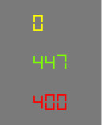
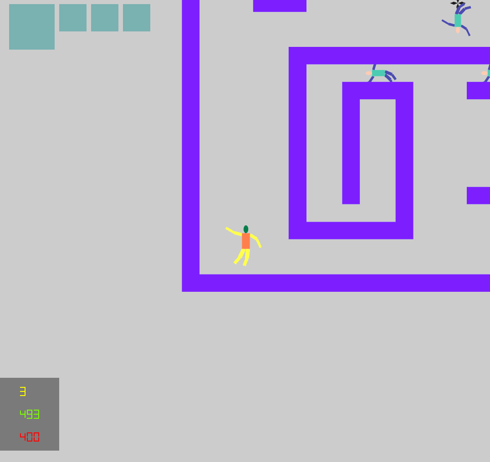
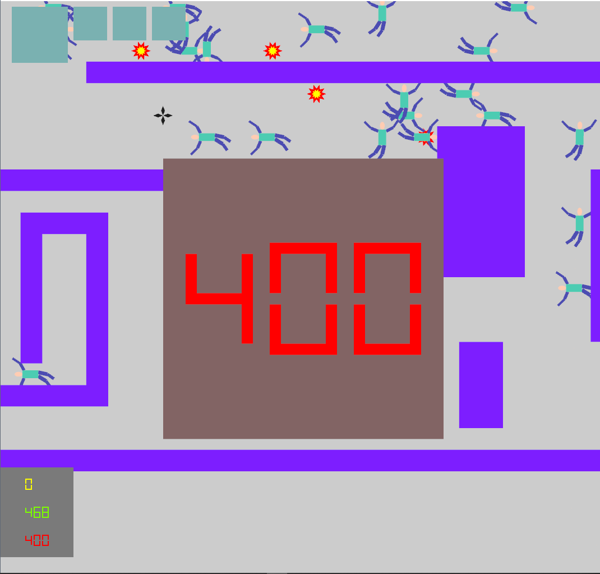

# Graphics Assn #2

##### <span style="float:right">20160785 양준하, 20160463 성해빈 </span>

## Introduction
이번 과제는 지난 Assn1을 바탕으로 하여 OpenGL의 셰이더를 사용하고 hierarchy 모델을 만드는 것이 목적이다.

## Background
### Transform

일반적인 3D 그래픽의 좌표계 transform 과정은 다음과 같다.

Model coord에서 world coord로 가는 과정은 Hiearchy model의 구현이 필요하다. 그 이후 canonical view volume으로 가기 위해서는 view transform과 projection transform이 필요하다. 

## Game
게임플레이 자체는 Assn1과 거의 동일하지만 메뉴얼에 명시한 추가기능(제한시간과 라이프)과 몇가지 그래픽적인 차이가 생겼다. 게임플레이 자체에 대한 설명은 Assn1 메뉴얼을 참고바라고, 여기에서는 추가적인 기능이나 달라진 부분만 설명한다.
### Restart
assn1에도 원래 있었던 기능이지만 이번에 명시적으로 추가를 요구했기에 설명한다. 게임오버 상황(라이프 소진 or 타임오버)나 게임클리어 상황(모든 적 사살)에 게임이 정지된다. 이 때 r키를 누르면 게임이 다시 시작된다. (오브젝트는 랜덤으로 다시 배치된다)
### Player and Enemy
플레이어와 에너미는 이제 hierarchy 모델을 이용하여 관절을 가진 사람모양의 형태가 된다. 또한 애니메이션도 가진다. 둘은 메뉴얼에서 요구한대로 똑같은 hiearchy 모델을 사용하지만 색깔만 다르다.


### CrazyMod
**추가기능 : ** 게임 중 아무때나 v키를 누르면 crazy mod로 들어갈 수 있다. 이는 우리 게임이 내부적으로 모든 3D 처리를 하고 있기 때문에 구현이 가능한 기능이다.
crazy mod에서는 더이상 카메라가 xy평면을 수직으로 바라보지 않고 갸우뚱 갸우뚱 돌아간다. 그와 동시에 게임내 모든 오브젝트들도 xy평면에 있지 않고 출렁거리는 z좌표를 가진다. 게임 로직 자체는 전혀 변하지 않고 렌더링 transformation 만 바뀌는 것이기 때문에 플레이는 그대로 할 수 있다. 다시 v를 누르면 원래대로 돌아간다


## Implementation

전반적인 구조는 Assn1과 동일하다. 매트릭스 연산은 모두 glm으로 수행하였다.

### Develop Environment

개발환경은 Visual Studio 2017 C++, 주어진 freeglut와 glew, glm 0.9.9.2 , winsdk 10.0.17134, opengl 4.6 이다. 

빌드는 Release로 해야하는데, STL의 사용이 많아 debug로 빌드하면 각종 Assertion들이 난무해서 게임속도가 심각하게 느려져서 정상적인 플레이가 불가능 할 수도 있다.

### Transform

일단 내부적으로 이 Assn2은 모두 3D 좌표계로 구현되어있다. (XY평면에 존재할 뿐이다)

Model coord에서 World coord로 가는 과정은 아래의 Hierachy Model에서 자세히 설명할 것이므로 view transform과 projection transform에 대해서 설명하겠다.
```c++
V_CTM = glm::mat4(1.0f);
V_CTM = glm::translate(V_CTM, glm::vec3(-1.0, -1.0, 0.0));
V_CTM = glm::scale(V_CTM, glm::vec3(2.0 / V_Screen_Size[0], 2.0 / V_Screen_Size[1], 1));
M_RenderUI();

glm::vec3 v(0.0f);
glm::vec3 up(0, 1, 0);
if (V_PEngine->V_CrazyMod)
{
v[0] = 100 * cos(count);
v[1] = 100 * sin(count);

up[1] = cos(DTR(30)*sin(count));
up[0] = sin(DTR(30)*sin(count));
}
V_CTM = glm::mat4(1.0f);
auto pers = glm::perspective(glm::radians(45.0f), 1.0f, 0.1f, 1000.0f);
auto view = glm::lookAt(glm::vec3(V_Camera_Pos[0], V_Camera_Pos[1], V_Camera_Height) + v,
glm::vec3(V_Camera_Pos[0], V_Camera_Pos[1], 0), up);

V_CTM = pers * view;
M_RenderGame();
```

다음 코드는 매 프레임마다 호출되는 CGraphics::M_CallbackDisplay()의 일부이다. M_RenderGame은 실제 world에 존재하는 오브젝트를 그리는 것으로 view transform과 projection transform을 모두 거쳐야하므로 호출하기 전에 V_CTM (current transform matrix)에 미리 다 적용을 해놓고 호출한다

M_RenderUI는 world내 오브젝트가 아니라 화면에 바로 보여야할 컴포넌트이기 때문에 화면좌표계에서 canonical view volume 좌표계로 가는 다른 transform을 적용시키고 호출한다.

반면 M_RenderGame은 world내 오브젝트를 출력하는 함수이기 때문에 view와 projection이 모두 필요하다. V_CrazyMod를 검사하는 반복문은 위에서 설명한 crazy mod에만 특별히 카메라를 흔들어대는 특수한 코드이므로 크게 신경쓰지 않아도 된다. 중요한 것은 밑의 glm::perspective와 glm::lookAt으로 부드러운 카메라 움직임 구현을 위해 계산된 V_Caemra_Pos(자세한건 assn1 참조바람)가 위에서 XY 평면을 바라보고 있게 했다. 실제로 게임오브젝트들은 XY평면에 다 누워있으므로 카메라 구도를 바꾸지 않는한(crzay mod) 2D drawing과 똑같은 효과를 낼 수 있다.

### CShaderManager

CShaderManager는 셰이더와 폴리곤을 관리하는 Singltone클래스로, 처음에 한번 초기화 되며 그 이후에 CGraphics에서 종종 참조된다.

##### CShaderManager::CShaderManager()

밑에서 설명할 하위 함수들을 호출하여 셰이더와 버텍스를 로딩하는 전체 초기화를 수행하는 생성자다. **추가기능 : **이 초기화 과정에서 외부에 있는 파일을 읽어와서 파싱하는 작업을 대거 하게 되는데, 이 포맷 자체는 간단하게 만든 독자포맷이다. 따라서 맘에 안든다면 폴리곤의 모양을 직접 수정할 수 있다. (resource/polygon.pol 과 item.pol)


##### CShaderManager::M_LoadShader()

셰이더를 로드해서 컴파일 한다. 이 부분은 아래 명시된 레퍼런스를 참조하였다. 
```c++
GLuint id = glCreateShader(type);
//중략
glShaderSource(id, 1, &sp, NULL);
glCompileShader(id);
```
핵심적으로 사용된 opengl 로직은 위와 같다.
##### CShaderManager::M_LoadPolygon()

폴리곤을 로드한다. 프로그램에서 사용될 다양한 오브젝트들은 다 여기서 로드되는 폴리곤을 transform해서 만들어지는 것이다. 파싱이 수반된다.

##### CShaderManager::M_LoadProgram()

opengl의 셰이더가 attach되는 오브젝트이 program을 생성하고 관리한다. 당장 필요한 기능은 아니지만, vertex 셰이더와 fragment 셰이더의 종류가 많으면 그 둘이 어떻게 결합되는지에 따라 program이 여러개 필요할 수도 있으므로 복수의 program을 로드하고 관리할 수 있게 구현되었다.
```c++
GLuint id = glCreateProgram();
glAttachShader(id, V_VerShaders[ver]);
glAttachShader(id, V_FragShaders[frag]);
glBindFragDataLocation(id, 0, "color");
glLinkProgram(id);
```
핵심적으로 사용된 opengl 로직은 위와 같다.

#### Shaders
실제로 우리가 assn2에서 사용한 vertex 셰이더와 fragment 셰이더는 각각 1개씩으로 아주 기초적인 일만 수행한다. 코드는 다음과 같다.

```c++
#version 330 core
in vec4 position;
uniform mat4 trans;
uniform vec4 vicolor;
out vec4 vocolor;

void main() // vertex shader
{
    vocolor = vicolor;
    gl_Position = trans*position ;
}
```

```c++
#version 330 core
in vec4 vocolor;
out vec4 color;

void main() // fragment shader
{
	color = vocolor;
}
```

### CHierModel

Hierarchy 모델을 추상화한 클래스로, 오브젝트 하나를 그리는데 필요한 모든 정보를 다 갖고 있으며  부분적인 Scene Graph가 될 수 있다.

##### struct SHierModelNode

Hierarchy 모델 tree상에서 node에 해당하는 구조체로, 다음과 같이 정의된다.
```c++
struct SHierModelNode
{
	SVerArray draw;
	glm::mat4 trans;
	glm::mat4 trans_s; // no inheritance

	int port;
	T4Double color;

	int left_child;
	int right_sibling;
	//후략
}
```
SVerArray는 실제로 draw할 정보이고 trans는 자신과 자식에게 모두 적용될 transform을 말한다. trans_s는 자신에게만 적용되는 transform으로 주로 모양만 변형하기 위해서 사용된다.
port는 애니메이션을 위해 사용되는 것으로 애니메이션이 적용될 위치를 나타내는 식별자다.
left_child와 right_sibling은 tree구조상 다음 traversal을 나타내는 index다.

##### CHierModel::CHierModel(vector\<SHierModelNode\>& t)

생성자로, 미리 만들어진 트리 t를 입력받는다.

##### CHierModel::M_Draw(glm::mat4 CTM)

Tree traversal을 실제로 할 재귀함수(밑에서 설명함)의 wrapper로 실제 외부에서 출력하기 위해 사용하는 인터페이스다.

##### CHierModel::M_Draw_Rec(int index, glm::mat4 CTM)
Hierarchy 모델의 핵심으로 tree를 traversal하면서 transform을 적용하고 draw한다.
```c++
void CHierModel::M_Draw_Rec(int index, glm::mat4 CTM)
{
	V_MatrixStack.push(CTM);
	SHierModelNode& node = V_Tree[index];

	//not exist -> identity
	glm::mat4 trans2 = V_Trans2.find(node.port) == V_Trans2.end() ? glm::mat4(1.0f) : V_Trans2[node.port];
	CTM = CTM * node.trans * trans2;

	auto temp = CTM * node.trans_s;

	glBindVertexArray(node.draw.aindex);
	GLuint p = glGetUniformLocation(V_Program, "trans");
	GLuint q = glGetUniformLocation(V_Program, "vicolor");
	glUniformMatrix4fv(p, 1, GL_FALSE, &temp[0][0]);
	float col[4]; 
	for(int i = 0; i< 4; i++) col[i] = node.color[i]; 
	glUniform4fv(q, 1, col);

	glDrawArrays(GL_TRIANGLE_STRIP, 0, node.draw.num);

	if (node.left_child != -1) M_Draw_Rec(node.left_child, CTM);
	CTM = V_MatrixStack.top();  V_MatrixStack.pop();
	if (node.right_sibling != -1) M_Draw_Rec(node.right_sibling, CTM);
}
```

V_MatrixStack은 tree를 traversal하면서 저장해야되는 transform matrix의 스냅샷을 저장하기 위한 스택이다. trans를 적용하기전에 push를 하고, 자식을 전부 방문한 이후에 sibling으로 갈때 다시 pop해서 사용한다.

trans2는 port에 할당된 애니메이션 matrix를 받아오는 것으로, 아직 할당된 게 없다면 Identity가 된다

일단 transform을 다 계산하면 실제로 셰이더를 이용해 draw를 해야하는데 이 때 glBindVertexArray()를 이용하여 해당 array에 bind를 한다. 그런다음 vertex 셰이더에 전해줄 transformation matrix와 색깔 uniform variables를 전달한다. 그런다음 glDrawArrays()를 하면 드디어 렌더링을 하게된다.

그 이후에 자식이나 sibling의 여부에 따라 적절히 traversal을 수행한다.

#### Animation
위에서 설명했듯 이 프로그램에서 애니메이션은 적절한 port에 적절한 transform을 등록함으로써 수행된다. 예컨대 플레이어의 팔다리 애니메이션은 다음과 같이 적용된다.

```c++
auto am1 = glm::rotate(glm::mat4(1.0), (float)(cos(anim) * 0.2 * PI), glm::vec3(0.0, 0.0, 1.0));
	auto am2 = glm::rotate(glm::mat4(1.0), (float)(sin(anim) * 0.2 * PI), glm::vec3(0.0, 0.0, 1.0));

	V_Hiers["player"]->M_RegisterTrans2(1, am1);
	V_Hiers["player"]->M_RegisterTrans2(2, am2);
```
anim은 매프레임마다 조금씩 증가하는 변수이다. 식을 보면 알겠지만 am1과 am2는 매 시간마다 조금씩 왔다갔다 하는 회전행렬이 된다. 둘이 내부적으로 cos/sin을 쓰고 있으므로 회전하는 각도는 살짝씩 딜레이가 있다. 이 am1과 am2를 각각 port 1과 port 2에 apply함으로써 사용자의 다리와 팔은 할당된 port에 맞게 적절하게 회전한다.

만약 플레이어가 총을 쏘는 상황이라면 그 상황에만 다른 애니메이션을 사용하여 오른손을 드는 형태를 만들었다.

### Text
Assn1까지는 텍스트 출력을 위해 opengl 자체 기능을 사용할수 있었으나 셰이더로 갈아타게 되면서 그 기능이 작동하지 않았다. 하지만 그렇다고 해서 텍스트를 출력할 수 있는 다른 방법이 있는 것도 아니었기에 숫자에만 대해서 polygon을 직접 출력하는 방식을 택했다. 숫자는 7-segment 방식으로 출력하였다.


## Example

평범한 실행 중 모습이다.

게임오버의 모습이다. r을 누르면 다시 시작 할 수 있다.

## Discussion

### GPU Optimization

아직 shader에 대해서 완벽하게 이해한게 아니라서 정확한 리소스 관리 방법에 대해 연구중이다. 예를들어 현재는 폴리곤 1개를 load할때마다 VBO와 VBA를 새로 만들고 있는데 그게 아니라 VBO는 크게 하나만 사용하고 VBA만 바꾸는게 효율적이지 않을까 생각은 해봤으나 실제로 그게 큰 문제인지는 아직 자료가 안나와서 모르겠다.

또한 shader가 현재는 1개씩이라서 문제가 없지만 여러개의 shader가 있을때 이를 attach, detach하는 것을 계속 해야하는지 아니면 program을 여러개 생성해놓고 미리 다 attach를 해놓고 program만 갈아야하는건지도 확실치 않다. (일단 후자의 방법으로 구현은 되어 있다.) 

### Vertex
현재는 vertex에 좌표밖에 없지만 색깔이나 텍스쳐 매핑 좌표도 포함시키는 것이 나중에 필요할 수도 있을 것 같다. 이에 대한 구현은 현재 되어 있지 않다.

### Hierarchy Model

현재 Hierarchy 모델에서 쓰고 있는 몇가지 방법 (animation을 위한 port할당, 상속되지 않는 trans_s 등)은 실제로 참고해서 따라한 것이 아니라 걍 필요하다고 생각해서 독자적으로 만든 방법이기 때문에 실제로 더 효율적이고 일반적인 방법을 조사해봐야할 필요는 있다.


## Conclusion
결론적으로 이번 어싸인에서는 OpenGL의 셰이더 기능을 활용하여 파이프라인을 직접 구성하여 게임을 만들 수 있었다. 또한 Hierarchy 모델을 이용하여 복잡한 움직임과 애니메이션을 구현하였다.


## Reference

OpenGL 사용법, 특히 shader를 로딩하는 과정과 사용방법에 대해서는 레퍼런스를 참고 했다.  하지만 게임로직과 hierarchy model의 구현은 100% 직접만든 원본이다.

[The OpenGL Utility Toolkit (GLUT) Programming Interface API Version 3](https://www.opengl.org/resources/libraries/glut/spec3/spec3.html)

[OpenGL® 4.5 Reference Pages](https://www.khronos.org/registry/OpenGL-Refpages/gl4/)

[Lighthouse3d.com](http://www.lighthouse3d.com/tutorials/glut-tutorial/)

[opengl-tutorial](http://www.opengl-tutorial.org/)


